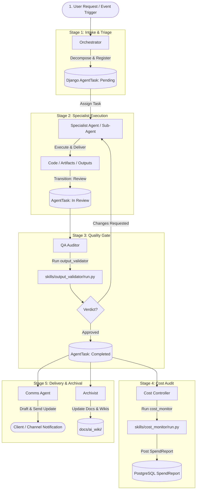

# Hermes Agent Team: Autonomous Workforce Specification

A profile-centric reference and planning document detailing each autonomous agent in the Hermes workforce, their individual responsibilities, dedicated skills, executable scripts, and inter-agent routing flows.

- **Status**: ACTIVE SPECIFICATION & PLANNING BASELINE
- **File**: [`docs/agent_team.md`](file:///home/ehab/Desktop/economy_editor/docs/agent_team.md)
- **Container Runtime**: Hermes Agent Container (`hermes-template-agent`), isolated network (`hermes_isolated_network`)
- **Backend Bridge**: Django REST API (`http://host.docker.internal:8000/api`) with Token Authentication & RBAC

---

## 1. Team Architecture Overview

The autonomous workforce operates under a decentralized division of labor:
- Each agent runs as an isolated persona within the Hermes runtime (`/root/.hermes/profiles/<name>/`).
- Each agent corresponds to a dedicated Django Service Account (`bot_<name>`) bound to native Django permissions (Principle of Least Privilege).
- Tasks are tracked in the PostgreSQL `AgentTask` registry and orchestrated through `apps.automation` Celery pipelines.

```
agent_service/
├── profiles/
│   ├── orchestrator/      # 1. Chief of Staff & Kanban Router
│   │   └── skills/task_decomposer/  # Profile-scoped DAG planner & dependency validator
│   ├── cost_controller/   # 2. Financial Controller & Budget Monitor
│   │   └── skills/cost_monitor/  # Profile-scoped SQLite spend auditor
│   ├── qa_auditor/        # 3. QA & Compliance Gatekeeper
│   │   └── skills/output_validator/ # Profile-scoped AST & security review tool
│   ├── comms_agent/       # 4. Client Communications Coordinator
│   ├── archivist/         # 5. Knowledge & Documentation Archivist
│   └── security_guard/    # 6. Dynamically Provisioned Specialist
└── skills/
    └── django_handshake/  # Shared system connectivity & health skill
```

---

## 2. Agent Profiles: Specifications, Skills & Scripts

---

### Agent 1: Orchestrator (`orchestrator`)

- **Role**: Chief of Staff / Request Intake & Kanban Router
- **Directory**: [`agent_service/profiles/orchestrator/`](file:///home/ehab/Desktop/economy_editor/agent_service/profiles/orchestrator/)
- **Service Account**: `bot_orchestrator` | **Django Group**: `Agent_Orchestrator`
- **Permissions**: `view_agentprofile`, `view_agenttask`, `add_agenttask`, `change_agenttask`
- **Calibrated Reasoning**: `none` (0-second latency for instant triage and routing)
- **Default Toolsets**: `kanban`, `delegate`, `terminal`, `file_ops`, `clarify` (Locked; heavy tools excluded)
- **Bundled Skills Opt-Out**: `.no-bundled-skills` active (pruned 54 bundled skills to prevent prompt bloat)

#### Primary Responsibilities
- **Request Intake**: Ingests incoming system prompts, automation triggers, or client requests.
- **Decomposition**: Breaks complex projects into atomic sub-tasks and registers them in `AgentTask`.
- **Kanban Routing**: Assigns sub-tasks to specialist agent profiles or spawns ephemeral sub-agents.
- **Deliverable Synthesis**: Aggregates completed outputs into a unified final delivery.

#### Dedicated Skills & Scripts
- **Skill**: **`task_decomposer`** ([`agent_service/profiles/orchestrator/skills/task_decomposer/`](file:///home/ehab/Desktop/economy_editor/agent_service/profiles/orchestrator/skills/task_decomposer/))
  - **Executable Script**: [`agent_service/profiles/orchestrator/skills/task_decomposer/run.py`](file:///home/ehab/Desktop/economy_editor/agent_service/profiles/orchestrator/skills/task_decomposer/run.py)
  - **What It Does**:
    1. Parses high-level objectives into a structured execution pipeline across the 5 department roles (`orchestrator`, `cost_controller`, `qa_auditor`, `comms_agent`, `archivist`).
    2. Enforces explicit dependency mapping and sequential DAG validation (cycle detection prevents execution deadlocks).
    3. Direct-submits decomposed tasks to the Django task queue (`POST /api/tasks/`) using `bot_orchestrator`'s API token when executed with `--submit`.
    4. Supports `--dry-run` and `--json` export for inspection and dry evaluation before dispatch.
- **Dynamic Task Delegation**: Uses Hermes native `delegate` tool to spawn ephemeral sub-agents for parallel work.
- **Kanban Dispatch**: Interacts with the backend task queue via `POST /api/tasks/` to register and reassign workloads.

---

### Agent 2: Cost Controller (`cost_controller`)

- **Role**: Financial Controller / Token Consumption & Budget Auditor
- **Directory**: [`agent_service/profiles/cost_controller/`](file:///home/ehab/Desktop/economy_editor/agent_service/profiles/cost_controller/)
- **Service Account**: `bot_cost_controller` | **Django Group**: `Agent_CostController`
- **Permissions**: `view_spendreport`, `add_spendreport`, `view_agentprofile` *(Explicitly blocked from creating/modifying tasks)*
- **Calibrated Reasoning**: `low` (sufficient for calculations without token waste)
- **Default Toolsets**: `terminal`, `file_ops` (Locked; web and bundled media tools excluded)
- **Bundled Skills Opt-Out**: `.no-bundled-skills` active (pruned 54 bundled skills to eliminate token overhead)

#### Primary Responsibilities
- **Token Tracking**: Scans LLM token consumption across all agent sessions in real time.
- **Budget Governance**: Enforces daily expenditure ceilings (`DAILY_BUDGET_CAP_USD`).
- **Spend Reporting**: Compiles and pushes audit reports to the Django backend.
- **Overrun Alerts**: Flags anomalous spikes and triggers pause actions if budgets are exceeded.
- **Model Efficiency Advisory**: Evaluates Intelligence-per-Dollar ROI using frontier benchmarks (DeepSWE) and recommends cheaper, high-accuracy alternatives.

#### Dedicated Skills & Scripts
- **Skill**: **`cost_monitor`** ([`agent_service/profiles/cost_controller/skills/cost_monitor/`](file:///home/ehab/Desktop/economy_editor/agent_service/profiles/cost_controller/skills/cost_monitor/))
  - **Executable Script**: [`agent_service/profiles/cost_controller/skills/cost_monitor/run.py`](file:///home/ehab/Desktop/economy_editor/agent_service/profiles/cost_controller/skills/cost_monitor/run.py)
  - **What It Does**:
    1. Scans SQLite databases (`state.db`) across all profiles in `/root/.hermes/profiles/`.
    2. Queries the `session_model_usage` table for prompt and completion token counts per model.
    3. Calculates estimated dollar costs using reference pricing tiers.
    4. Evaluates total spend against the `--daily-budget` parameter.
    5. Queries Django's model benchmark registry (`GET /api/hermes/benchmarks/`) to calculate Intelligence-to-Cost ratios ($ROI = \text{score} / \text{cost}$).
    6. Automatically generates cost-efficiency recommendations when alternative models offer equal or higher pass rates at lower cost.
    7. Dispatches structured `SpendReport` and recommendations directly to `POST /api/spend-reports/` when invoked with `--push`.

---

### Agent 3: QA Auditor (`qa_auditor`)

- **Role**: Quality Assurance & Compliance Gatekeeper
- **Directory**: [`agent_service/profiles/qa_auditor/`](file:///home/ehab/Desktop/economy_editor/agent_service/profiles/qa_auditor/)
- **Service Account**: `bot_qa_auditor` | **Django Group**: `Agent_QAAuditor`
- **Permissions**: `view_agenttask`, `change_agenttask`, `view_agentprofile` *(Exclusive authorization to submit review verdicts)*
- **Calibrated Reasoning**: `high` (deep analytical reasoning for rigorous inspection)
- **Default Toolsets**: `kanban`, `terminal`, `file_ops`

#### Primary Responsibilities
- **Deliverable Gatekeeper**: Serves as the mandatory review checkpoint before any task is marked `completed`.
- **Syntax & Integrity Checks**: Verifies that generated code, data, and configs compile and parse cleanly.
- **Hygiene & Security Review**: Catches leftover stub placeholders and hardcoded credentials.
- **Authoritative Verdicts**: Submits binding decisions (`approved` or `changes_requested`).

#### Dedicated Skills & Scripts
- **Skill**: **`output_validator`** ([`agent_service/profiles/qa_auditor/skills/output_validator/`](file:///home/ehab/Desktop/economy_editor/agent_service/profiles/qa_auditor/skills/output_validator/))
  - **Executable Script**: [`agent_service/profiles/qa_auditor/skills/output_validator/run.py`](file:///home/ehab/Desktop/economy_editor/agent_service/profiles/qa_auditor/skills/output_validator/run.py)
  - **What It Does**:
    1. **Multi-Format Parsing**: Compiles Python AST to detect syntax errors; parses JSON/YAML schemas; checks Markdown fences and link integrity.
    2. **Placeholder Trapping**: Scans files for unfinished markers (`TODO`, `FIXME`, `CHANGEME`, stubbed passes).
    3. **Security Audit**: Scans for leaked API keys, tokens, or private secrets.
    4. **Scoring & Verdict**: Generates a 0–100 quality score and emits an authoritative verdict (`APPROVED` vs `CHANGES_REQUESTED`).
    5. Submits verdict and reviewer feedback to Django via `POST /api/tasks/<id>/submit-verdict/`.

---

### Agent 4: Comms Agent (`comms_agent`)

- **Role**: Client Communications Coordinator & Meeting Scheduler
- **Directory**: [`agent_service/profiles/comms_agent/`](file:///home/ehab/Desktop/economy_editor/agent_service/profiles/comms_agent/)
- **Service Account**: `bot_comms_agent` | **Django Group**: `Agent_CommsAgent`
- **Permissions**: `view_agenttask`, `view_agentprofile`
- **Calibrated Reasoning**: `none` (fast, fluent natural language output)
- **Default Toolsets**: `file_ops`, `terminal`

#### Primary Responsibilities
- **External Messaging**: Translates technical outputs into clear, professional, client-facing language.
- **Email & Update Drafting**: Prepares milestone updates, release summaries, and status reports.
- **Notification Bridging**: Dispatches messages across system channels (Email, Webhook, Slack) via `apps.notifications`.

#### Dedicated Skills & Scripts
- **Notification Dispatch**: Interfaces with `apps.notifications.dispatcher.NotificationDispatcher` to route updates based on user/client preferences.

---

### Agent 5: Archivist (`archivist`)

- **Role**: Knowledge Archivist & Institutional Memory Custodian
- **Directory**: [`agent_service/profiles/archivist/`](file:///home/ehab/Desktop/economy_editor/agent_service/profiles/archivist/)
- **Service Account**: `bot_archivist` | **Django Group**: `Agent_Archivist`
- **Permissions**: `view_agentprofile`, `view_agenttask`
- **Calibrated Reasoning**: `low` (straightforward indexing and synthesis)
- **Default Toolsets**: `file_ops`, `terminal`, `web`

#### Primary Responsibilities
- **Documentation Maintenance**: Updates project documentation and system wikis ([`docs/ai_wiki/`](file:///home/ehab/Desktop/economy_editor/docs/ai_wiki/)).
- **SOP Extraction**: Extracts reusable standard operating procedures from completed task histories.
- **Institutional Memory**: Indexes key architectural decisions, resolved issues, and patterns for future reference.

#### Dedicated Skills & Scripts
- **Wiki Synchronization**: Uses `file_ops` and Markdown tooling to maintain [`docs/ai_wiki/index.md`](file:///home/ehab/Desktop/economy_editor/docs/ai_wiki/index.md) and [`docs/ai_wiki/architecture.md`](file:///home/ehab/Desktop/economy_editor/docs/ai_wiki/architecture.md).

---

### Dynamic / Specialized Profiles (e.g. `security_guard`)

- **Provisioning Engine**: `apps.automation` via `auto_provision_hermes_profile` action.
- **Example Profile**: [`agent_service/profiles/security_guard/`](file:///home/ehab/Desktop/economy_editor/agent_service/profiles/security_guard/)
- **Role**: `general` (Security Auditor)
- **Mechanism**: Dynamically creates declarative profile folders, generates a bot user in Django, issues a DRF token, and writes the runtime `.env` file without container restarts.

---

## 3. Shared System Skills & Provisioning Scripts

These scripts support the team's infrastructure, connectivity, and lifecycle management.

| Script / Skill | Location | Purpose |
| :--- | :--- | :--- |
| **`django_handshake`** | [`agent_service/skills/django_handshake/run.py`](file:///home/ehab/Desktop/economy_editor/agent_service/skills/django_handshake/run.py) | Probes backend health (`GET /api/health/`), submits container handshake (`POST /api/handshake/`), confirms PostgreSQL persistence. |
| **`provision_profiles.py`** | [`scripts/provision_profiles.py`](file:///home/ehab/Desktop/economy_editor/scripts/provision_profiles.py) | Synchronizes profile folders to Hermes container runtime (`/root/.hermes/profiles/`), fetches bot tokens from Django, writes runtime `.env` files. |
| **`verify_handshake.py`** | [`scripts/verify_handshake.py`](file:///home/ehab/Desktop/economy_editor/scripts/verify_handshake.py) | Empirically tests cross-container reachability and verifies API handshakes. |

---

## 4. Inter-Agent Task Routing & Interaction Lifecycle

Tasks follow a deterministic, auditable route through the team:



### Step-by-Step Flow:
1. **Intake (`orchestrator`)**: Ingests the task, creates structured `AgentTask` records, and assigns them to the appropriate specialist.
2. **Execution (Specialist / Sub-Agent)**: The executing agent works on the task and transitions status from `pending` ➔ `in_progress` ➔ `review`.
3. **QA Review Gate (`qa_auditor`)**: `qa_auditor` inspects deliverables using `output_validator`. If clean, it marks `approved`. If defective, it submits `changes_requested` with structured notes and loops back to the executor.
4. **Spend Audit (`cost_controller`)**: Evaluates token consumption and updates `SpendReport`. If spend exceeds budget thresholds, alerts are triggered.
5. **Client Handoff (`comms_agent`)**: Composes external-facing summaries and notifies stakeholders.
6. **Archival (`archivist`)**: Indexes deliverables, extracts SOPs, and synchronizes documentation in `docs/ai_wiki/`.

---

## 5. Discussion & Planning Agenda

Use this section as the launching pad for team refinement:

1. **Role Expansion**:
   - Do we need a dedicated `security_auditor` or `backend_developer` profile?
   - What specific toolsets should each new role possess?
2. **Skill Library Expansion**:
   - What recurring workflows should be packaged into new skills in `agent_service/skills/` (e.g. automated test runner, API contract tester, database migration validator)?
3. **Routing Enhancements**:
   - How should handoffs be coordinated: via deterministic Celery pipelines, or dynamic autonomous delegation by `orchestrator`?
   - Should QA gate failures trigger automated retry loops with max retry counts?
4. **Governance & Limits**:
   - Should budget caps be defined per profile, per tenant workspace, or globally?
