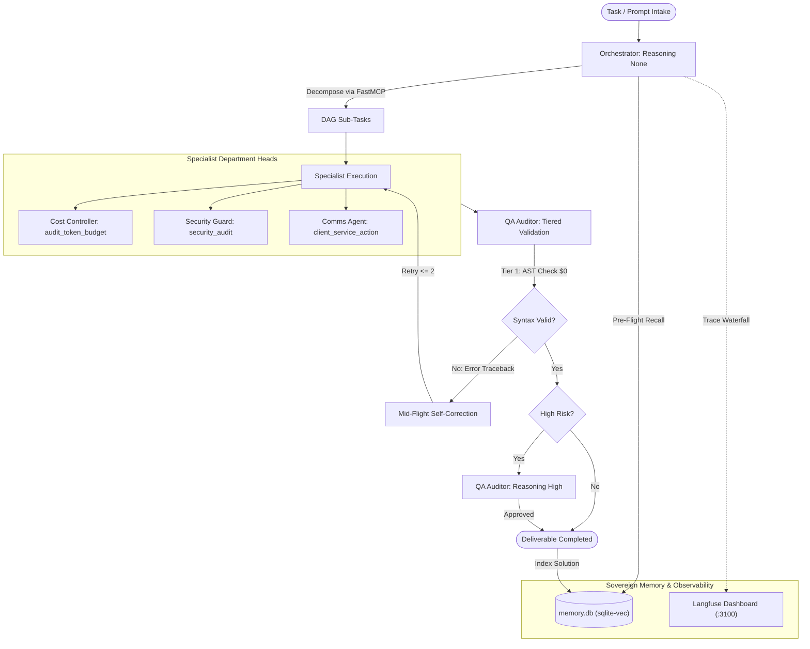

# Sovereign Autonomous Agent Team: Workforce Specification

A profile-centric specification detailing each autonomous agent in the Sovereign Workforce, their calibrated reasoning budgets, dedicated Model Context Protocol (FastMCP) tools, and collaborative execution flows.

- **Status**: ACTIVE SPECIFICATION
- **File**: [`docs/agent_team.md`](file:///home/ehab/Desktop/economy_editor/docs/agent_team.md)
- **Container Runtime**: Hermes Agent Container (`hermes-template-agent`), isolated network (`hermes_isolated_network`)
- **Protocol**: OpenAI-compatible REST API Gateway (`http://localhost:8643`) and internal FastMCP tools

---

## 1. Team Architecture Overview

The autonomous workforce operates under a decentralized, sovereign division of labor:
- Each agent runs as an isolated profile within the Hermes runtime (`agent_service/profiles/<name>/`).
- Tool execution occurs natively in-process via FastMCP (`agent_service/mcp/system_tools_server.py`) over JSON-RPC 2.0.
- Semantic memory is shared and retrieved via embedded `sqlite-vec` (`agent_service/data/memory.db`).
- Turn-by-turn thought streams, latency, and costs are tracked in real time via Langfuse (`:3100`).

```
agent_service/
├── profiles/
│   ├── orchestrator/      # 1. Chief of Staff & DAG Planner (@mcp.tool: decompose_task_dag)
│   ├── cost_controller/   # 2. Financial Controller & Budget Monitor (@mcp.tool: audit_token_budget)
│   ├── qa_auditor/        # 3. QA & Compliance Gatekeeper (@mcp.tool: validate_code_deliverable)
│   ├── comms_agent/       # 4. Client Communications Concierge (@mcp.tool: client_service_action)
│   └── security_guard/    # 5. SecOps & Threat Auditor (@mcp.tool: security_audit)
├── mcp/
│   └── system_tools_server.py # Central FastMCP server
├── memory/
│   └── vector_store.py    # Embedded sqlite-vec memory store
└── telemetry/
    └── tracer.py          # Langfuse OpenTelemetry tracer
```

---

## 2. Agent Profiles: Specifications & FastMCP Capabilities

---

### Agent 1: Orchestrator (`orchestrator`)

- **Role**: Chief of Staff / Request Intake & DAG Planner
- **Directory**: `agent_service/profiles/orchestrator/`
- **Calibrated Reasoning**: `none` (0-second latency for instant triage and routing)
- **Default Toolsets**: `kanban`, `delegate`, `mcp`, `file_ops`
- **Bundled Skills Opt-Out**: `.no-bundled-skills` active (pruned 54 bundled skills to prevent prompt bloat)

#### Primary Responsibilities
- **Request Intake**: Ingests incoming system prompts or client requests.
- **Decomposition**: Decomposes complex objectives into atomic sub-tasks with clear dependency ordering.
- **Memory Augmentation**: Auto-queries `memory.db` prior to decomposition to reuse proven task patterns.
- **Deliverable Synthesis**: Aggregates completed outputs from specialists into a cohesive final delivery.

#### Dedicated FastMCP Tools
- `@mcp.tool() decompose_task_dag(objective: str, context: dict)`:
  - Generates directed acyclic graphs (DAGs) of tasks.
  - Injects top-2 similar solved task plans into turn 1.
  - Rejects circular dependencies and missing prerequisites.

---

### Agent 2: Cost Controller (`cost_controller`)

- **Role**: Financial Controller & Token Spend Auditor
- **Directory**: `agent_service/profiles/cost_controller/`
- **Calibrated Reasoning**: `low` (lightweight mathematical verification)
- **Default Toolsets**: `mcp`, `file_ops`
- **Bundled Skills Opt-Out**: `.no-bundled-skills` active

#### Primary Responsibilities
- **Budget Governance**: Enforces daily dollar budget caps ($ USD) and warns before budget depletion.
- **Real-Time Telemetry Audit**: Ingests streaming token metrics directly from Langfuse.
- **Model Efficiency Advisory**: Recommends optimal model choices based on benchmark Intelligence-to-Cost ratios.

#### Dedicated FastMCP Tools
- `@mcp.tool() audit_token_budget(daily_cap_usd: float)`:
  - Queries Langfuse telemetry streams for real-time prompt, completion, and total token usage.
  - Emits status: `HEALTHY`, `VELOCITY_WARNING` (50%), `CRITICAL` (75%), or `EXCEEDED` (100%).

---

### Agent 3: QA Auditor (`qa_auditor`)

- **Role**: Quality Assurance & Compliance Gatekeeper
- **Directory**: `agent_service/profiles/qa_auditor/`
- **Calibrated Reasoning**: `high` (rigorous deep-thinking code and deliverable review)
- **Default Toolsets**: `mcp`, `file_ops`, `terminal`
- **Bundled Skills Opt-Out**: `.no-bundled-skills` active

#### Primary Responsibilities
- **Tiered Risk-Based Validation**:
  - Tier 1: Deterministic in-process AST and schema verification ($0, <5ms).
  - Tier 2: Mid-flight traceback injection for instant self-correction.
  - Tier 3: Authoritative high-reasoning review reserved for high-risk or low-confidence deliverables.
- **Deliverable Hygiene**: Ensures zero placeholder code (`TODO`, `FIXME`, stubbed mocks).

#### Dedicated FastMCP Tools
- `@mcp.tool() validate_code_deliverable(target_file: str, schema_type: str)`:
  - Compiles Python AST and checks syntax deterministically.
  - Scans for security seatbelts (e.g. exposed API keys or private certificates).
  - Returns structured verdict: `approved`, `changes_requested`, or `rejected`.

---

### Agent 4: Comms Agent (`comms_agent`)

- **Role**: Client Communications Coordinator & Concierge
- **Directory**: `agent_service/profiles/comms_agent/`
- **Calibrated Reasoning**: `none` (zero latency for instant responses)
- **Default Toolsets**: `mcp`, `file_ops`
- **Bundled Skills Opt-Out**: `.no-bundled-skills` active

#### Primary Responsibilities
- **Client Service Concierge**: Natural language client interface and ticket intake.
- **Zero-Trust Document Access**: Accesses files strictly through validated permissions with SHA-256 integrity checks.
- **Proactive Notifications**: Formats and dispatches structured milestone notifications.

#### Dedicated FastMCP Tools
- `@mcp.tool() client_service_action(action_type: str, payload: dict)`:
  - Handles client queries and document inventory requests over authenticated JSON-RPC.
  - Enforces client dollar milestones (25%, 50%, 75%, 100%).

---

### Agent 5: Security Guard (`security_guard`)

- **Role**: Security & Threat Auditor (SecOps)
- **Directory**: `agent_service/profiles/security_guard/`
- **Calibrated Reasoning**: `high` (deep threat modeling and vulnerability auditing)
- **Default Toolsets**: `mcp`, `file_ops`, `terminal`
- **Bundled Skills Opt-Out**: `.no-bundled-skills` active

#### Primary Responsibilities
- **Secret Leak Detection**: Deep regex scanning for OpenAI, OpenRouter, Anthropic, Stripe, and private RSA/SSH keys.
- **Boundary Verification**: Verifies data isolation, tenant boundaries, and least-privilege policies.
- **Vulnerability Scanning**: Proactively checks dependencies and configuration files for exposure.

#### Dedicated FastMCP Tools
- `@mcp.tool() security_audit(scan_path: str, mode: str)`:
  - High-speed in-memory scan for leaked credentials.
  - Audits RBAC configurations and file permission boundaries.

---

## 3. Autonomous Execution & Routing Workflow



---

## 4. Summary Matrix: The Sovereign Workforce

| Profile | Calibrated Reasoning | Primary FastMCP Tool | Target Latency | Optimization Focus |
| :--- | :--- | :--- | :--- | :--- |
| **`orchestrator`** | `none` | `decompose_task_dag` | < 1 sec | Instant triage, memory-augmented DAG decomposition |
| **`cost_controller`** | `low` | `audit_token_budget` | < 3 sec | Real-time budget tracking via Langfuse telemetry |
| **`qa_auditor`** | `high` | `validate_code_deliverable` | Dynamic | Tiered QA: $0 deterministic AST check, conditional LLM |
| **`comms_agent`** | `none` | `client_service_action` | < 1 sec | Zero-latency concierge, zero-trust document streaming |
| **`security_guard`** | `high` | `security_audit` | < 5 sec | In-memory regex secret scanning & boundary audits |
