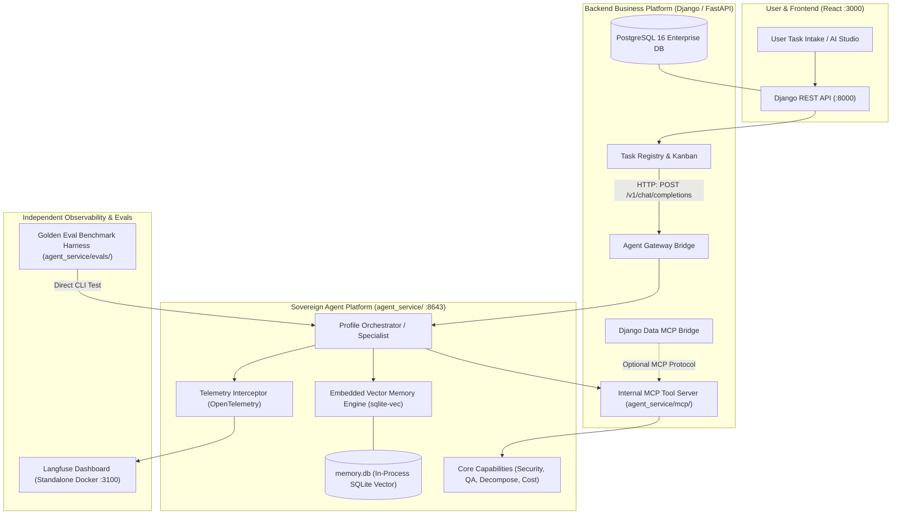

# Implementation Plan: Sovereign Enterprise Agent Platform & Self-Refining Engine

- **Status**: PENDING REVIEW <!-- PENDING | IN_PROGRESS | COMPLETED -->
- **Target Repository**: `devalees/ai_system_template`
- **Architectural Paradigm**: **Two Sovereign Microservices (100% Decoupled & Swappable)**
- **Creation Date**: 2026-09-13
- **Primary References**:
  - Active Plan: [`docs/plans/active_plan.md`](file:///home/ehab/Desktop/economy_editor/docs/plans/active_plan.md)
  - Agent Team Specification: [`docs/agent_team.md`](file:///home/ehab/Desktop/economy_editor/docs/agent_team.md)
  - System Overview: [`docs/ai_wiki/index.md`](file:///home/ehab/Desktop/economy_editor/docs/ai_wiki/index.md)
  - Architecture Reference: [`docs/ai_wiki/architecture.md`](file:///home/ehab/Desktop/economy_editor/docs/ai_wiki/architecture.md)

---

## 1. Executive Summary & Objective

The objective of this plan is to transform the existing Hermes Agent runtime into a **Sovereign, Enterprise-Grade AI Agent Platform** that is **100% independent and decoupled from the Django backend**.

### The Core Architectural Principle: Two Sovereign Pillars
The system is built upon two completely decoupled backbones communicating strictly over standard protocols (HTTP REST & Model Context Protocol):
1. **The Backend Platform (`backend/`)**: Django 5.x (or any future framework like FastAPI/Go) managing enterprise business applications (Accounting, HR, ERP), PostgreSQL 16 relational records, tenant security, and client accounts.
2. **The Sovereign Agent Platform (`agent_service/`)**: A self-contained, portable AI intelligence package holding its own profiles, tool capabilities, embedded vector memory, and evaluation benchmarks.

```
+------------------------------------+           +-------------------------------------+
|      Backend Platform              |           |      Sovereign Agent Platform       |
|      (Django / FastAPI)            |           |      (Hermes / Portable Agent)      |
|                                    |   HTTP    |                                     |
|  • Enterprise Business Logic       |◄─────────►|  • 5 Calibrated Profiles            |
|  • PostgreSQL 16 Relational Data   |  Task API |  • Embedded Vector Memory           |
|  • Tenant RBAC & Client Vaults     |           |    (sqlite-vec in memory.db)        |
|  • Data Provider MCP Bridge        |◄─────────►|  • Internal MCP Tool Ecosystem      |
+------------------------------------+    MCP    |  • Independent Benchmark Evals      |
                                                 +-------------------------------------+
                                                                    ▲
                                                                    │ OpenTelemetry
                                                 +------------------▼------------------+
                                                 |  Langfuse Dashboard (Standalone)    |
                                                 |  - Visual Trace Trees & Costs       |
                                                 +-------------------------------------+
```

### Key Independence Guarantees
- **Portability**: You can lift `agent_service/` and plug it into **FastAPI**, **Next.js**, **Express**, or run it as a standalone CLI with **zero code modifications**.
- **Swappability**: You can swap Hermes for another agent engine (e.g. LangGraph, CrewAI, AutoGen) inside `agent_service/` without touching a single Django view or model.
- **Zero Database Dependency**: The agent's memory lives in **`sqlite-vec`** (`agent_service/data/memory.db`), completely independent of Django's database.

---

## 2. The 6 Sovereign Pillars

1. **Embedded Sovereign Semantic Memory (`sqlite-vec`)**: In-process vector database inside `agent_service/data/memory.db`. Zero network latency, zero dependencies on external DB servers, and 100% portable with the agent folder.
2. **Model Context Protocol (MCP) Standardized Tooling**: All agent tools run as native MCP servers inside `agent_service/mcp/`, communicating via JSON-RPC.
3. **Glass-Box Observability & Tracing (Langfuse)**: Independent Docker container (`ghcr.io/langfuse/langfuse:2`) capturing turn-by-turn thought streams, latency waterfalls, and token pricing.
4. **Schema-Strict Tool Contracts & Mid-Flight Error Recovery**: Pydantic input/output models with automatic error injection and anti-loop circuit breakers.
5. **Independent Golden Benchmark Evaluation Suite (`agent_service/evals/`)**: Automated test harness running directly against the agent runtime (`pytest agent_service/evals/`) without needing Django running.
6. **Cross-Project Knowledge Portability & Dual-Tier Architecture**: Clean separation between global procedural wisdom (exportable to new projects) and project-local client confidentiality.

---

## 3. Comparison Matrix: Current State vs. Sovereign Architecture

| Dimension | Current State (Now) | Sovereign Architecture (Target) | Operational & Architectural Impact |
| :--- | :--- | :--- | :--- |
| **1. Memory & Knowledge (Adaptation)** | **Ephemeral & Session-Bound**<br>• Agents forget past solutions once a task concludes.<br>• Identical problems require full exploration from scratch each time. | **Embedded Sovereign Memory (`sqlite-vec`)**<br>• `agent_service/data/memory.db` stores vector embeddings directly inside the agent container.<br>• Agents retrieve top-3 relevant past solutions before turn 1.<br>• Zero dependency on Django. | **Transformative**<br>• 100% portable with the `agent_service` folder.<br>• Drops average task completion latency by 50–70%. |
| **2. Tooling & Integrations** | **Bespoke CLI Scripts**<br>• Every capability requires a custom Python argparse script in `skills/<name>/run.py`.<br>• Manual symlinking and profile YAML editing for each tool. | **Universal MCP (Model Context Protocol)**<br>• Standardized MCP servers inside `agent_service/mcp/`.<br>• Native JSON-RPC execution in memory (no bash terminal overhead).<br>• Backend data accessible via optional MCP bridges. | **High**<br>• Standardized across all profiles.<br>• Plug-and-play access to external community MCP servers. |
| **3. Monitoring & Observability** | **Black-Box Cost Totals**<br>• High-level daily token totals in `SpendReport` and model CRUD diffs in `ActivityLog`.<br>• Cannot visualize turn-by-turn thought process or per-tool latency. | **Standalone Glass-Box Tracing (Langfuse)**<br>• Independent Docker service (`localhost:3100`).<br>• Interactive visual trace trees: prompt injection, LLM thinking time, tool execution duration, token pricing.<br>• Directly instrumented in `agent_service`. | **Transformative**<br>• Complete visibility into agent reasoning.<br>• Works with or without Django. |
| **4. Error Recovery & Self-Correction** | **Late-Stage Review Gate**<br>• Quality control happens predominantly at the end of the pipeline when `qa_auditor` inspects the final output files.<br>• Sub-step tool failures rely on raw CLI stderr. | **Multi-Tiered Self-Healing**<br>• Strict Pydantic input/output schemas at tool boundaries.<br>• Automatic mid-flight retry with explicit error explanation injected into the context.<br>• Circuit breakers abort runaway tool loops. | **High**<br>• Prevents tool hallucination.<br>• Catches syntax and argument mistakes before wasting turns. |
| **5. Continuous Improvement (Evals)** | **Ad-Hoc Manual Tweaking**<br>• Improving an agent means guessing changes to `SOUL.md`.<br>• No automated way to verify if adjusting a prompt for one problem broke another capability. | **Independent Golden Benchmark Suite**<br>• Located in `agent_service/evals/`.<br>• Automated suite of 25+ real-world domain scenarios executed via `pytest`.<br>• Evaluates agent intelligence standalone without needing a backend server. | **Transformative**<br>• Replaces prompt guesswork with quantitative software engineering.<br>• Proves model upgrades improve performance. |
| **6. Cross-Project Portability** | **Siloed & Trapped**<br>• Capabilities and lessons learned in one domain cannot be exported without manual copy-pasting.<br>• Memory tied to Django database risks data cross-contamination. | **Sovereign Package Portability**<br>• The entire `agent_service/` directory is an independent Git repository/submodule.<br>• Export/Import CLI for procedural knowledge.<br>• Ready to drop into any future repository on Day 1. | **Transformative**<br>• Compounding returns across all your software ventures.<br>• Zero risk of client data cross-contamination. |

---

## 4. High-Level Architecture & Data Flow



---

## 5. Detailed Technical Specifications Across the 6 Milestones

### Milestone 1: Embedded Sovereign Semantic Memory (`sqlite-vec`)

#### 1.1 Objectives
- Give the agent platform its own embedded, ultra-fast vector memory that lives inside `agent_service/` with zero dependency on PostgreSQL or Django.
- Eliminate agent amnesia and slash cold-start task latency by 50–70%.

#### 1.2 Technical Plan
- **Vector Engine**: Install `sqlite-vec` inside the `hermes-template-agent` container runtime.
- **Embedded Database**: Create `agent_service/data/memory.db`.
- **Memory Manager (`agent_service/memory/vector_store.py`)**:
  - `MemoryStore` class:
    - Tables: `memory_entries` (id, category, title, content, scope, created_at) and virtual vector table `vec_entries` using `sqlite-vec` (768 or 1536 dimensions).
    - `add_memory(title, content, category, scope='generalized')`: Computes embedding and stores in SQLite.
    - `recall_similar(query_text, top_k=3, threshold=0.75)`: In-memory cosine distance search returning top solutions in < 15ms.
- **Agent Loop Hook**:
  - In `agent_service/core/runner.py`: On task initialization, automatically query `memory.db` for the task prompt and inject top-2 matching past solutions into the system turn.
- **Task Success Indexing**:
  - Upon task completion with approved status, summarize the winning approach and index into `memory.db`.

#### 1.3 Key Deliverables
- [ ] `sqlite-vec` installation in `agent_service/Dockerfile`
- [ ] `agent_service/memory/vector_store.py` with vector similarity search
- [ ] Automated recall hook in agent prompt pre-flight
- [ ] Standalone test verifying semantic recall within `agent_service`

---

### Milestone 2: Internal Model Context Protocol (MCP) Tool Ecosystem

#### 2.1 Objectives
- Replace legacy CLI terminal scripts with native, high-speed MCP tool servers running directly inside `agent_service/mcp/`.
- Decouple agent capabilities from shell commands.

#### 2.2 Technical Plan
- **FastMCP Framework**:
  - Install `mcp` Python SDK in `agent_service/`.
  - Create central MCP server `agent_service/mcp/system_tools_server.py`.
- **Porting Core Capabilities to MCP Tools**:
  - `security_scan(mode: str, path: str)`: Wraps existing `security_scanner` logic.
  - `validate_output(file_path: str, schema_type: str)`: Wraps existing `output_validator` AST logic.
  - `decompose_task(objective: str)`: Wraps `task_decomposer` DAG logic.
  - `audit_spend(daily_cap: float)`: Wraps `cost_monitor` logic.
- **Profile Tool Scoping**:
  - Each profile's `config.yaml` declares which MCP tools it can access.
- **Backend Data Bridge (Optional MCP)**:
  - If the agent needs to query Django records (e.g. clients or tasks), it queries a standalone `django-data-mcp` bridge over standard HTTP JSON-RPC.

#### 2.3 Key Deliverables
- [ ] `agent_service/mcp/system_tools_server.py` exposing core capabilities as MCP tools
- [ ] FastMCP registration in Hermes profile configurations
- [ ] Deprecation of raw bash subprocess execution for internal capabilities

---

### Milestone 3: Standalone Glass-Box Tracing & LLMOps (Langfuse)

#### 3.1 Objectives
- Provide complete visual transparency into agent reasoning, token costs, and tool execution latency.
- Run as an independent monitoring service completely decoupled from both Django and Hermes.

#### 3.2 Technical Plan
- **Docker Infrastructure**:
  - Add independent Langfuse service to root `docker-compose.yml`:
    - Image: `ghcr.io/langfuse/langfuse:2`
    - Port: `3100:3000`
    - Uses lightweight SQLite or dedicated standalone schema.
- **Telemetry Interceptor in `agent_service`**:
  - Wrap agent invocation loops with `langfuse` Python SDK / OpenTelemetry:
    - **Trace**: Root Task UUID, profile name, reasoning effort.
    - **Generation Spans**: LLM prompt, thought stream, output tokens, cost ($ USD).
    - **Tool Spans**: MCP tool name, arguments, execution duration (ms), error status.
- **Independence**:
  - Hermes logs to Langfuse whether it is invoked by Django, FastAPI, or via CLI directly.

#### 3.3 Key Deliverables
- [ ] Docker compose configuration for Langfuse (:3100)
- [ ] OpenTelemetry interceptor in `agent_service/telemetry/tracer.py`
- [ ] Verified visual trace waterfalls for multi-turn agent tasks

---

### Milestone 4: Schema-Strict Execution & Mid-Flight Error Recovery

#### 4.1 Objectives
- Stop agents from hallucinating tool arguments or looping endlessly on syntax errors.
- Ensure all tool invocations are strictly validated against Pydantic models before execution.

#### 4.2 Technical Plan
- **Pydantic Validation Layer**:
  - Every MCP tool defines strict Pydantic argument schemas (`class SecurityScanInput(BaseModel): ...`).
  - Malformed inputs are rejected immediately in memory with zero API or shell overhead.
- **Mid-Flight Error Reflection**:
  - Instead of aborting the task, the exact validation error is injected back into the LLM context:
    `"Error: Tool 'security_scan' requires 'mode' to be one of ['leaks', 'tenant', 'rbac']. You provided 'all'. Please correct your input."`
- **Circuit Breaker**:
  - Abort if an agent repeats the same invalid tool invocation twice consecutively.

#### 4.3 Key Deliverables
- [ ] Pydantic argument schemas for all internal MCP tools
- [ ] Mid-flight error reflection formatter
- [ ] Anti-loop circuit breaker middleware

---

### Milestone 5: Independent Golden Benchmark Evaluation Suite

#### 5.1 Objectives
- Establish an automated, objective testing pipeline for agent intelligence located **entirely within `agent_service/evals/`**.
- Enable certifying and benchmarking the agent platform independently of any backend.

#### 5.2 Technical Plan
- **Evaluation Harness (`agent_service/evals/`)**:
  - Test suite built with `pytest`:
    - Tests are invoked with: `pytest agent_service/evals/`
    - 25+ deterministic domain scenarios:
      1. `test_orchestrator_decomposes_complex_task`
      2. `test_security_guard_detects_api_key_leak`
      3. `test_qa_auditor_rejects_syntax_errors`
      4. `test_memory_recall_returns_correct_prior_pattern`
      5. `test_circuit_breaker_halts_infinite_loop`
- **Quantitative Metrics**:
  - Pass Rate (Target >= 90%)
  - Tool Invocation Accuracy (Target 100%)
  - Average Cost per Benchmark Run (Target <= $0.05)
  - Average Duration (Target <= 15s)

#### 5.3 Key Deliverables
- [ ] Benchmark harness in `agent_service/evals/`
- [ ] 25 deterministic golden test cases
- [ ] Standalone CLI execution script: `./scripts/run_agent_evals.sh`

---

### Milestone 6: Cross-Project Portability & The Sovereign Agent Package

#### 6.1 Objectives
- Enable lifting the entire `agent_service/` directory and dropping it into any future project (e.g. Accounting, Legal, Healthcare, CLI) as a ready-to-use, intelligent agent engine.
- Provide a sanitized Knowledge Export/Import CLI for procedural wisdom.

#### 6.2 Technical Plan
- **The Sovereign Package Structure**:
  - `agent_service/` is structured as a self-contained Git repository/submodule:
    ```
    agent_service/
    ├── Dockerfile
    ├── docker-compose.yml
    ├── profiles/          # The 5 Calibrated Profiles (SOUL.md, config.yaml)
    ├── mcp/               # Standardized MCP Tool Servers
    ├── memory/            # sqlite-vec Vector Engine
    ├── data/              # memory.db (Persistent vector store)
    ├── evals/             # Golden Benchmark Test Suite
    └── telemetry/         # Langfuse OpenTelemetry Hooks
    ```
- **Knowledge Export & Import CLI (`agent_service/memory/cli.py`)**:
  - **Export Command**:
    ```bash
    python -m agent_service.memory.cli export --scope generalized --output knowledge_seed.jsonl
    ```
    - Exports generalized procedural patterns and embeddings while stripping all private client data.
  - **Import Command**:
    ```bash
    python -m agent_service.memory.cli import --input knowledge_seed.jsonl
    ```
    - Ingests vector embeddings into a new project's `memory.db` in seconds.

#### 6.3 Key Deliverables
- [ ] Self-contained `agent_service/` package architecture
- [ ] Standalone Knowledge CLI `agent_service/memory/cli.py` (export/import)
- [ ] Documentation guide on dropping `agent_service` into FastAPI, Next.js, or new Django apps

---

## 6. Practical Profile Refactoring Matrix (The 5 Existing Department Heads)

This section defines the precise, practical refactoring actions applied to the existing 5 agent profiles to transition them from legacy bash subprocess scripts into high-speed MCP tools and memory-augmented specialists:

| Profile Name | Current Legacy Mechanism | Refactored Sovereign Mechanism | Practical Action & Behavior Shift |
| :--- | :--- | :--- | :--- |
| **`qa_auditor`**<br>*(QA & Compliance Gatekeeper)* | Mandatory 2nd LLM turn with `reasoning: high` executing `output_validator/run.py` via bash terminal for **every** task. | **Tiered Risk-Based Validation**:<br>• **Tier 1 ($0, < 5ms)**: Deterministic in-process AST compiler & Pydantic validation (zero LLM tokens).<br>• **Tier 2 (Mid-Flight)**: Instant traceback injection into active agent turn for auto-correction.<br>• **Tier 3 (Conditional LLM)**: `qa_auditor` invoked **only** for high-risk / financial tasks or when self-confidence < 85%. | • Converts `output_validator/run.py` to `@mcp.tool() validate_code_deliverable`.<br>• Slashes routine QA review cost & latency by **80%**.<br>• Eliminates the mandatory bottleneck for trivial tasks. |
| **`orchestrator`**<br>*(Chief of Staff & DAG Planner)* | Spawns bash subprocess running `skills/task_decomposer/run.py`. No historical memory. | **Memory-Augmented FastMCP**:<br>• Automatic pre-flight query to `sqlite-vec` in `memory.db` before task decomposition.<br>• Reuses proven past decomposition patterns.<br>• Assigns QA review conditionally (only to high-risk sub-tasks). | • Converts `task_decomposer/run.py` to `@mcp.tool() decompose_task_dag`.<br>• Injects top-2 similar solved task plans into turn 1.<br>• Slashes planning turns from 3+ down to 1. |
| **`cost_controller`**<br>*(Financial Controller)* | Spawns bash subprocess running `skills/cost_monitor/run.py` to poll SQLite `state.db` files on disk. | **Real-Time Langfuse Telemetry Hook**:<br>• Directly queries Langfuse token pricing streams via MCP.<br>• Real-time budget alerting and enforcement. | • Converts `cost_monitor/run.py` to `@mcp.tool() audit_token_budget`.<br>• Replaces disk-polling with streaming telemetry metrics. |
| **`comms_agent`**<br>*(Client Concierge)* | Spawns bash subprocess running `skills/client_service_bridge/run.py` with multi-mode CLI subcommands. | **Native Client Service MCP**:<br>• Standardized JSON-RPC tool calls for document queries and client budget checks.<br>• Direct streaming access without terminal overhead. | • Converts `client_service_bridge/run.py` to `@mcp.tool() client_service_action`.<br>• Eliminates CLI argument parsing delays. |
| **`security_guard`**<br>*(SecOps & Threat Auditor)* | Spawns bash subprocess running `skills/security_scanner/run.py` with `--mode leaks/tenant/rbac`. | **In-Memory SecOps MCP Tool**:<br>• High-speed in-memory regex scanning and tenant isolation audit.<br>• Strict Pydantic input schemas preventing malformed audit commands. | • Converts `security_scanner/run.py` to `@mcp.tool() security_audit`.<br>• Runs security checks in milliseconds without OS process spawning. |

### Profile Configuration Refactoring (`config.yaml`)
For each profile in `agent_service/profiles/<name>/config.yaml`:
1. **Preserve Personas**: Retain all existing `SOUL.md` persona instructions, boundaries, and calibrated reasoning efforts (`none`, `low`, `high`).
2. **Remove Bash References**: Remove legacy `skills:` path references and terminal execution dependencies.
3. **Register MCP Server**: Bind the unified internal MCP server (`agent_service/mcp/system_tools_server.py`).
4. **Enable Memory Hook**: Set `enable_memory_recall: true` to auto-query `agent_service/data/memory.db`.

---

## 7. Phased Implementation Roadmap

```
Phase 36: Embedded Sovereign Memory (Milestone 1)
  ├── Step 1: Install sqlite-vec in agent_service container
  ├── Step 2: Implement agent_service/memory/vector_store.py (memory.db)
  ├── Step 3: Wire automated semantic recall into agent pre-flight loop
  └── Step 4: Verify in-process semantic recall with zero backend dependency

Phase 37: Standalone Observability & Glass-Box Tracing (Milestone 3)
  ├── Step 1: Add independent Langfuse service to docker-compose.yml (:3100)
  ├── Step 2: Implement OpenTelemetry interceptor in agent_service/telemetry/
  ├── Step 3: Verify visual trace waterfalls, token costs, and per-tool latencies
  └── Step 4: Add dashboard navigation links to Django Admin & TopBar

Phase 38: Standardized Tooling, Self-Correction & Profile Refactoring (Milestones 2 & 4)
  ├── Step 1: Implement FastMCP server in agent_service/mcp/system_tools_server.py
  ├── Step 2: Refactor the 5 profiles from CLI scripts to native MCP tools (Matrix in Section 6)
  ├── Step 3: Implement Tiered Risk-Based QA review (Deterministic Tier 1 vs Conditional Tier 3)
  ├── Step 4: Add Pydantic input/output validation to all MCP tools
  └── Step 5: Implement mid-flight error reflection and loop circuit breakers

Phase 39: Independent Golden Benchmark Evaluation Suite (Milestone 5)
  ├── Step 1: Scaffold agent_service/evals/ test harness with pytest
  ├── Step 2: Author 25 deterministic golden test cases across the 5 agent roles
  ├── Step 3: Implement `./scripts/run_agent_evals.sh` CLI runner
  └── Step 4: Establish automated CI/CD benchmark verification

Phase 40: Sovereign Package Portability & Knowledge CLI (Milestone 6)
  ├── Step 1: Structure agent_service/ as a standalone, modular package
  ├── Step 2: Implement agent_service/memory/cli.py (export/import)
  ├── Step 3: Verify dropping agent_service into a clean standalone test environment
  └── Step 4: Document the Cross-Project Portability standard in docs/ai_wiki/
```

---

## 8. Hardware & Infrastructure Footprint

| Component | Additional Server Needed? | RAM Footprint | CPU Overhead | Monthly Hosting Cost |
| :--- | :--- | :--- | :--- | :--- |
| **`sqlite-vec`** | **No** (In-process inside `agent_service`) | ~10–25 MB | Negligible (in-memory C extension) | **$0** |

| **MCP Tool Server** | **No** (In-process inside `agent_service`) | ~15–30 MB | Negligible (JSON-RPC) | **$0** |
| **Langfuse** | **No** (Lightweight Docker service) | ~200–350 MB | Low (~1–3% CPU during logging) | **$0** |
| **Golden Evals**| **No** (Pytest CLI executed on demand) | Transient | Only during benchmark execution | **$0** |
| **TOTAL** | **0 New External Servers** | **~225–400 MB RAM** | **Standard Host is more than sufficient** | **$0 Added Cost** |

---

## 9. Verification & Success Criteria

1. **Total Sovereignty**:
   - `agent_service/` can be started, executed, and benchmarked with the Django backend container completely stopped (`docker stop django-template-backend`).
2. **Memory Recall**:
   - Repeat task prompt resolves in **1 turn instead of 4 turns**, cutting task duration by > 50% using `memory.db`.
3. **Observability**:
   - Every agent task generates an active Langfuse trace URL visible in `http://localhost:3100`.
4. **Tool Safety**:
   - Invalid tool arguments trigger instant Pydantic self-correction without crash or unhandled 500 error.
5. **Benchmark Score**:
   - `./scripts/run_agent_evals.sh` passes at >= 90% across all 25 golden test cases in under 3 minutes.
6. **Cross-Project Portability**:
   - `python -m agent_service.memory.cli export --scope generalized` outputs a clean, PII-free JSONL file that successfully imports into a fresh template database with 100% vector search recall.
